# 5-Section Stripline Coupler Project Report  
## Microwave & Antenna 1 Course
## Instructor: Dr. Ahmad Bakhtafrouz
### Isfahan University of Technology


---

## Table of Contents
- [Project Overview](#project-overview)
- [Coupler Calculations and Pre-Design Notes](#coupler-calculations-and-pre-design-notes)
- [Building the Middle Section (Section 3) of the Coupler](#building-the-middle-section-section-3-of-the-coupler)
- [Bend Calculations for Spacing Transition](#bend-calculations-for-spacing-transition)
- [Building Sections 2 and 4 of the Coupler](#building-sections-2-and-4-of-the-coupler)
- [Building Sections 1 and 5 of the Coupler](#building-sections-1-and-5-of-the-coupler)
- [Building the Port Feed Conductors](#building-the-port-feed-conductors)
- [Building the Dielectric](#building-the-dielectric)
- [Building the Ground Conductors](#building-the-ground-conductors)
- [Building the Ports](#building-the-ports)
- [Simulation Results](#simulation-results)
- [Conclusion](#conclusion)

---

## Project Overview

In this project, we build a **5-section stripline coupler** in **CST Studio Suite**.

The coupler specifications are as follows:

- Reference impedance: **50 Ω**
- Center frequency: **2.1 GHz**
- Dielectric thickness: **787 µm (0.787 mm)**
- Substrate: **Rogers RT/duroid 5870**
- Metal thickness: **35 µm (0.035 mm)**
- Coupling: **16 dB**

In the rest of this report, the full procedure of building and simulating this coupler is explained.

The CST and MATLAB files used in this project are provided alongside this report in the repository.

Additionally, several videos (simulation animations) are included.

---

## Coupler Calculations and Pre-Design Notes

To compute the coupling coefficients and the even/odd impedances of each coupler section, the following MATLAB script was written.  
The required equations are solved using this script.

When the script is executed, it asks for:
1) the number of coupler sections, and  
2) the desired coupling (in dB),  
then it prints the coupling coefficients and the even/odd impedances of each section.

```matlab
clear all; clc;
syms theta; 
% Sections
N = input("Please enter the sections of the coupler: ");
% Coupling param
Coupling_db = input("Please enter the coupling of the coupler (dB): ");
Coupling = 10^(-Coupling_db/20);
Z_0 = 50;
C = cell(1, (N+1)/2);
for i=1:(N+1)/2-1
 C{i} = 2*sin(theta)*cos((N-1-2*(i-1))*theta);
end
C{(N+1)/2} = sin(theta);
c = 0;
coeffs = cell(1, (N+1)/2);
while c ~= (N+1)/2
 c_values = zeros(1, (N+1)/2);
 for i=1:length(C)
 c_values(i) = subs(C{i}, theta, pi/2);
 end
 if (~all(c_values == 0))
 c = c + 1;
 coeffs{c} = c_values;
 end
 for i=1:length(C)
 C{i} = diff(C{i}, theta, 1);
 end
 
end
A = zeros((N+1)/2, (N+1)/2);
for i=1:length(coeffs)
 A(i, :) = coeffs{i};
end
B = zeros((N+1)/2, 1); B(1) = Coupling;
X = linsolve(A, B);
fprintf("Coupling parameters:\n");
for i=1:length(X)
 fprintf("C_%d=%f\n", i, X(i))
end
fprintf("Even and Odd Impedances:\n")
for i=1:length(X)
 fprintf("Z_%d(even)=%f\n", i, Z_0*sqrt((1 + X(i))/(1 - X(i))));
 fprintf("Z_%d(odd)=%f\n", i, Z_0*sqrt((1 - X(i))/(1 + X(i))));
end
```

Using this script, we obtain the even and odd impedances.

Now, we must use these even/odd impedances to determine the **trace width** and the **spacing between the two traces** at different sections of the coupler.

One possible method is a **graphical design approach** using the following figure, but it has very low accuracy.

> 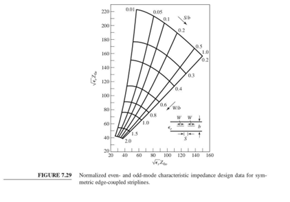

Another method (used in this project) is to use the following website:

[https://wcalc.sourceforge.net/cgi-bin/coupled_stripline.cgi](https://wcalc.sourceforge.net/cgi-bin/coupled_stripline.cgi)

Unfortunately, despite attempts to find the exact computational algorithm used in the website and its available source code, no success was achieved.

The website interface is as follows:

> 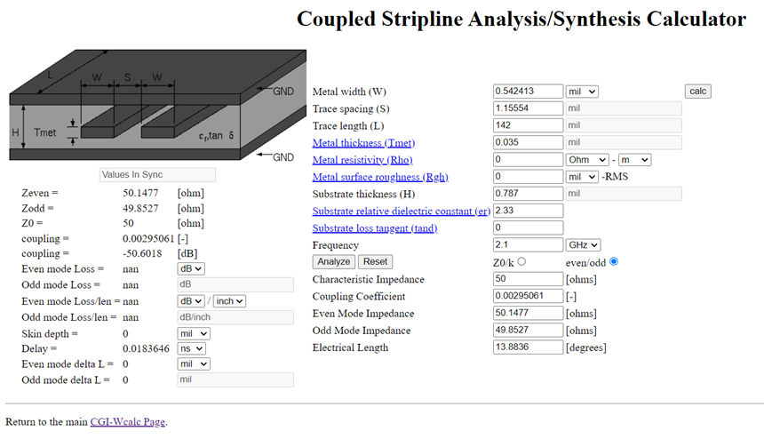

On the right side of the page, we enter:

* `Trace Length (L)`
* `Metal thickness (Tmet)`
* `Substrate thickness (H)`
* `Substrate relative dielectric constant (er)`

Then we set the mode to **even/odd** and enter:

* `Even Mode Impedance`
* `Odd Mode Impedance`

After pressing the `calc` button at the top, the values:

* `Metal Width (W)`
* `Trace Spacing (S)`
  are computed and displayed.

By repeating this process for all three required cases (due to symmetry), we obtain the following values.

### Table — Trace width (W) and trace spacing (S) for each section

| Section |        W |        S |
| ------: | -------: | -------: |
|    1, 5 | 0.542413 |  1.15554 |
|    2, 4 | 0.541601 |  0.59661 |
|       3 | 0.513594 | 0.148489 |

Another important note is that, to design this coupler, we must use the **effective wavelength** (λ_eff), computed as follows.

$`\lambda_0 = \frac{c}{f}, \qquad
\lambda_{\mathrm{eff}} = \frac{\lambda_0}{\sqrt{\varepsilon_r}}`$

For this stripline design using Rogers RT/duroid 5870, λ_eff is used as the electrical length basis in the CST model.

Finally, the overall design should conceptually resemble the following multi-section structure with the effective wavelength and the obtained parameters.

> 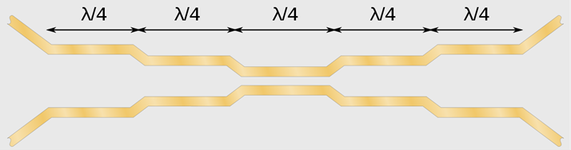

---

## Building the Middle Section (Section 3) of the Coupler

From the **Modeling** tab, select **Brick**, then press **Esc** to open the parameter dialog.

In this dialog, enter the values exactly as shown in the report figure.
Here:

* `S_3` is the spacing between the two traces in the middle section,
* `TraceTk` is the conductor thickness,
* `lmbd` is the (effective) wavelength.

> 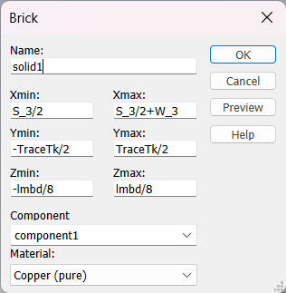

In the **Material** section, choose **Load from Material Library**, then select **Copper (pure)** so the conductors are copper.

After pressing **OK**, the upper trace of the middle section is created.

To create the lower trace of the middle section, repeat the same steps, but use:

* instead of `Xmin`, enter: `-S_3/2 - W_3`
* instead of `Xmax`, enter: `-S_3/2`

The variable values used are as follows :

> 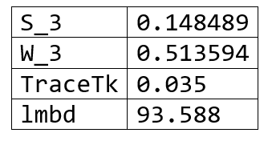

The result of the above steps is shown below:

> 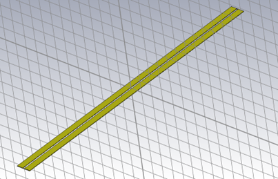

---

## Bend Calculations for Spacing Transition

For the bend used to change the spacing between traces, we need a short calculation.

These bends are made with a **45-degree angle**. The geometry is shown below.
In this figure, **X** is the unknown length we need.

> 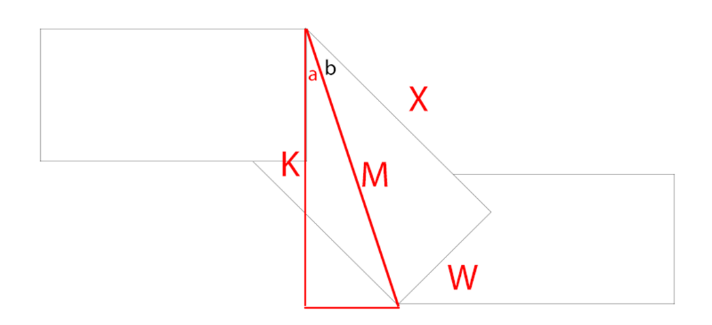

Because the bend angle is 45 degrees, the diagonal relation implies a √2 factor between the required offset and the diagonal length.

On the other hand, we know that **K** equals one trace width **(W)** plus **half of the difference between the spacings** of the two sections:

$`K = W + \frac{\Delta S}{2}`$

Therefore, the required diagonal length (used in the CST construction) becomes:

$`X = \sqrt{2},K = \sqrt{2}\left(W + \frac{\Delta S}{2}\right)`$

This exact √2 structure is used in the CST parameterization of the bend bricks.

---

## Building Sections 2 and 4 of the Coupler

From the **Modeling** tab, enable **Local WCS** and choose **Align WCS**.

Then, by double-clicking the point specified in the figure, we set the coordinate system origin to that point.

Next, using **Transform WCS → Rotate**, rotate **45 degrees around the V axis** so the coordinate system becomes as shown.

> 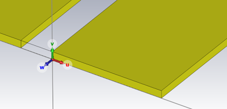

> 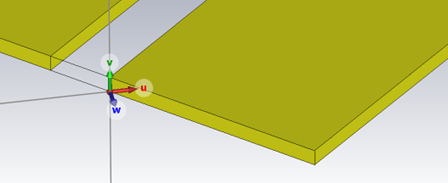

Now, using **Brick** and the settings shown below, we build the first part of the bend.

> 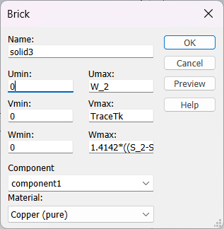

In the above settings, the parameter `Wmax` (shown in the report) is:

$`W_{\max} = X = \sqrt{2}\left(W_2 + \frac{S_2 - S_3}{2}\right)`$

(As explicitly used in the CST dialog via a numeric √2 factor.)

The result at this stage is shown below.

> 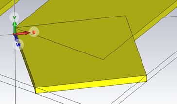

The parameters used in the steps above also have the following values:

> 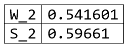

Next, repeat the above steps and set the WCS origin to the point shown below.

> 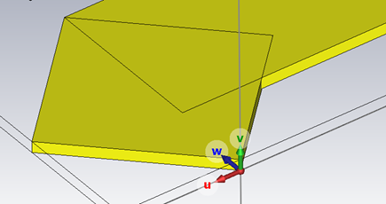

Now create another Brick with the settings shown below.

> 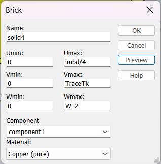

Now, in **Modeling → Boolean → Add**, add `solid3` and `solid4` into `solid1` so the following shape is created.
In practice, this merges:

* the created bend part,
* the initially created line,
  into a single solid.

> 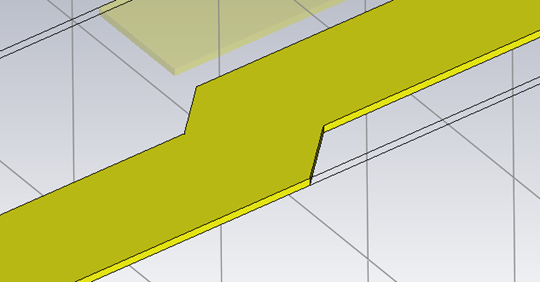

Finally, repeat the above procedure for the other three ends of the two transmission lines (symmetry) to obtain the overall view below.

> 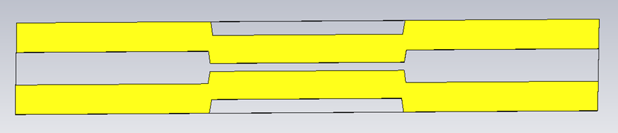

Note: In the above figure, the vertical scale is magnified.

---

## Building Sections 1 and 5 of the Coupler

Similar to the previous steps (building sections 2 and 4), for each of the four ends of the already-built coupler, we:

* create a 45-degree bend, and
* connect a transmission line segment,
  to build sections 1 and 5.

The bend parameters for this part are shown below.

> 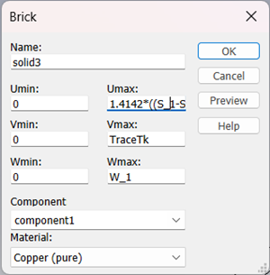

Here, `Umax` is again the same **X** computed in the bend-calculation section.

After completing this stage, the structure becomes:

> 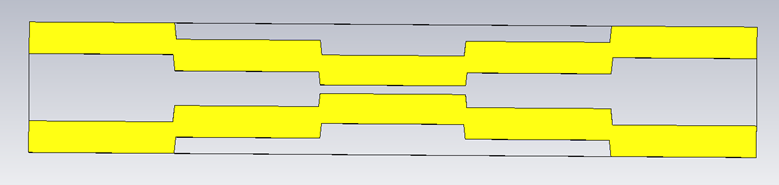

At this point, the coupler conductors are complete.
The next steps to finalize the full stripline structure are:

* creating 4 feed conductors for the ports,
* building the dielectric,
* building the two ground conductors.

---

## Building the Port Feed Conductors

To connect the coupler to the ports, we attach four vertical conductors to the four ends of the coupler.

We follow the steps below:

Set the coordinate system origin at the point shown:

> 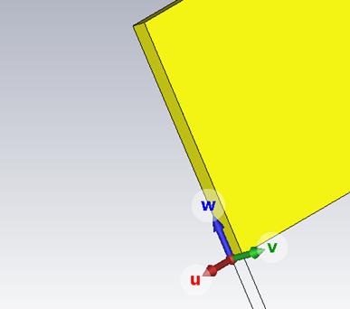

Draw the feed conductor as shown, and using **Boolean**, add it to the corresponding coupler conductor:

> 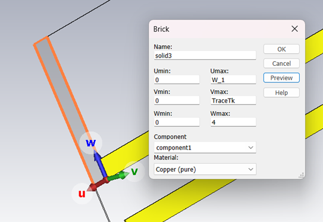

Repeat the above steps for all four ends of the coupler.

At the end, the structure should look like this:

> 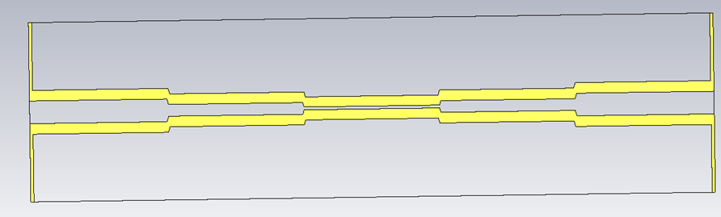

---

## Building the Dielectric

In this step, we design the dielectric.

Disable **Local WCS** to return to the **Global** coordinate system.

Then, right-click the created component and choose **Object Information** to obtain the length and width of the structure.

An example of the structure dimensions is shown below (as in the report screenshot).

> 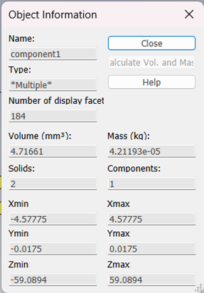

Now create a Brick with the following properties:

> 

For `DielectricTk`, enter **0.787** (the dielectric thickness).
For `TotalWidth`, enter a value equal to **2 × Xmax** (based on the structure width obtained from Object Information).

---

## Building the Ground Conductors

Create two Bricks with the following specifications:

> 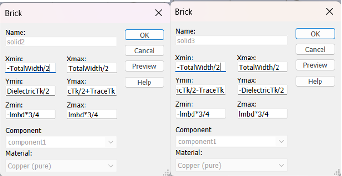

The `Ymin` of the right figure and the `Ymax` of the left figure are, respectively:

$`Y_{\min} = -\frac{\text{DielectricTk}}{2} - \text{TraceTk}, \qquad
Y_{\max} = \frac{\text{DielectricTk}}{2} + \text{TraceTk}`$

At this stage, the result should look like this:

> 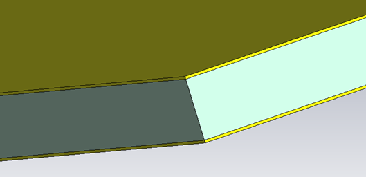

Meaning that:

* the coupler conductors,
* the dielectric,
* and the ground conductors,
  are now created.

Effectively, the stripline coupler structure is complete.

---

## Building the Ports

To build ports, we use the macro:

**Calculate port extension coefficient**
Accessible via: `VBA Macros > Solver > Ports`

Procedure:

1. First, select the face where the port should be placed using **Pick**, as shown below, then run the macro.

> 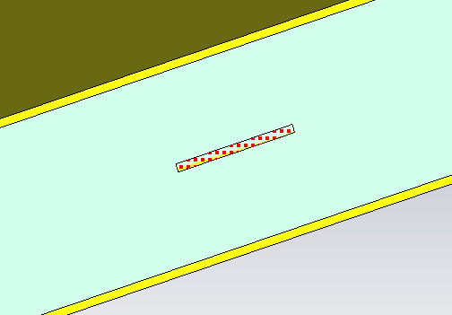

2. The following window opens:

> 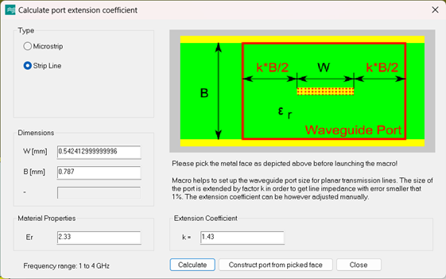

3. First choose **Calculate**, then choose **Construct port from picked face**.
   The port will be created on the selected face.

Repeat the above steps for all four ports in the intended order.

### Troubleshooting

Sometimes, when running the macro, we may encounter the following error:

> 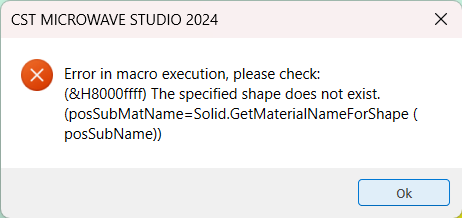

To fix this error, slightly increase the width of the dielectric structure and the ground planes.
For example, set `TotalWidth` to a slightly larger value than the previously used `2 × Xmax`.
After increasing `TotalWidth`, the error is resolved.

---

## Simulation Results

We simulate the project in **Time Domain** mode.

The S-parameter results are as follows. The coupler performance is clearly very good.

> 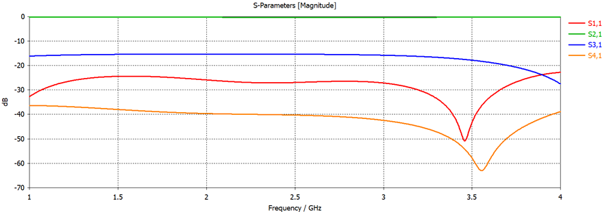

* Coupling is approximately **16 dB**.
* Return loss is below **−20 dB**, which is excellent.
* Isolation is below **−30 dB**, which is also very good.

### Port Mode Results

> 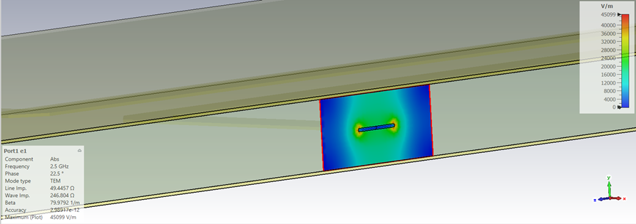

> 

### E-Field Results

> 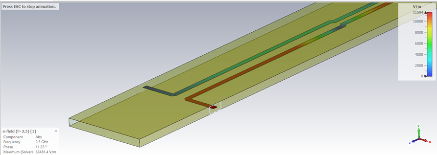

#### Port 1 and Port 3 animation.
> 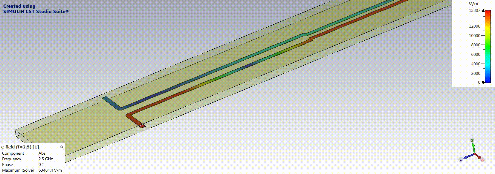

#### Port 2 and Port 4 animation.
> 

### H-Field Results

> 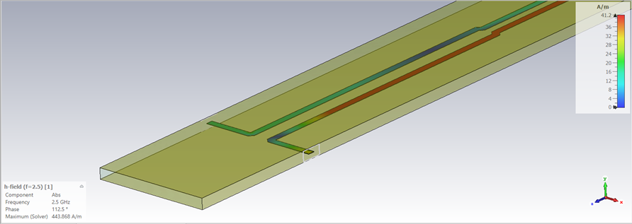

---

## Conclusion

In this project, the full process from design to implementation and simulation of a **5-section stripline coupler** was completed.
All modeling steps and simulation results were provided in this report.

Thanks for your attention ⭐

---
